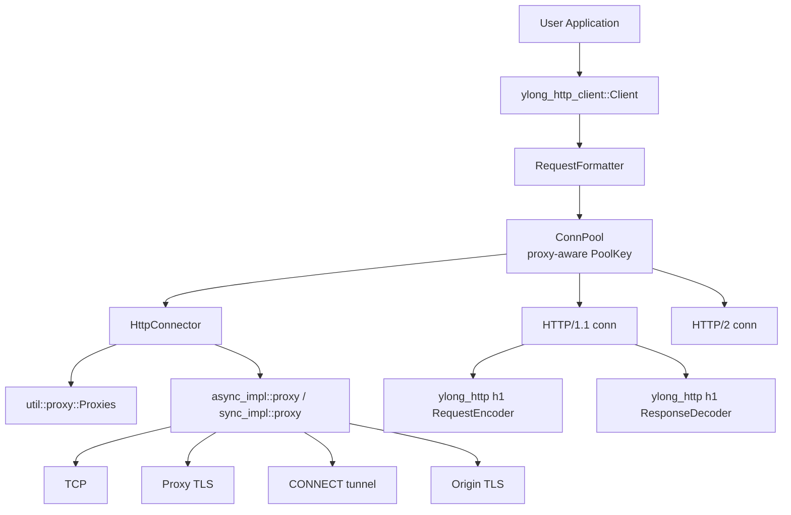
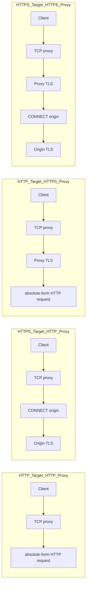
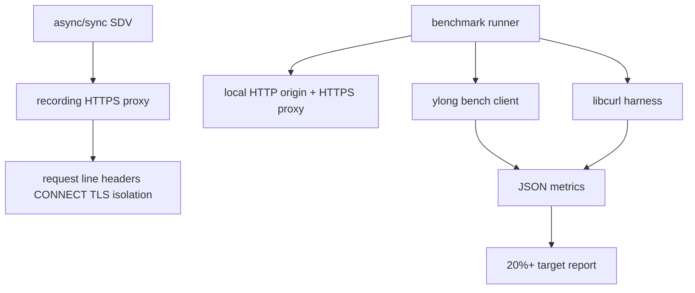

# ylong_http 项目架构设计

本文档面向 `ylong_http_client` HTTPS 代理开发，记录当前项目结构、请求生命周期、TLS/代理分层，以及后续扩展应从哪里下手。

## Workspace 结构

仓库由两个 Rust crate 组成：

- `ylong_http`：HTTP 协议基础库，提供 URI、Header、Request、Response、HTTP/1.1 编解码、HTTP/2 HPACK/frame、HTTP/3 QPACK/frame 等协议能力。
- `ylong_http_client`：客户端库，提供 async/sync Client、连接池、Connector、TLS 适配、代理、重定向、上传下载和监控信息。

HTTPS 代理工作的主要边界在 `ylong_http_client`。`ylong_http` 已有 `Scheme`、`Authority` 和 `RequestEncoder::absolute_uri`，当前实现不需要改动协议 crate。

## 客户端分层

`ylong_http_client` 的实现分三层：

- `async_impl`：异步客户端。HTTPS proxy 主路径位于 `async_impl/connector/mod.rs`，proxy TLS 和 CONNECT tunnel 辅助逻辑位于 `async_impl/proxy.rs`。
- `sync_impl`：同步客户端。HTTPS proxy parity 已补齐，sync proxy TLS 和 CONNECT tunnel 辅助逻辑位于 `sync_impl/proxy.rs`。
- `util`：同步/异步共享能力，包括 `proxy`、`config`、`pool`、`dispatcher`、`c_openssl`、`normalizer`、`monitor`。

## 请求生命周期

async HTTP/1.1 主路径：

1. `Client::request` 接收用户请求。
2. `RequestFormatter` 补齐 scheme、host、port、path、默认 header。
3. `ConnPool` 按目标 URI 和 proxy identity 获取或创建连接，避免跨代理配置复用。
4. `HttpConnector` 根据目标 URI 匹配 `Proxy` 规则。
5. 如果命中代理，Connector 根据代理 URL scheme 选择 HTTP proxy 或 HTTPS proxy transport。
6. HTTP target over proxy 使用 absolute-form request target，并按需写入 `Proxy-Authorization`。
7. HTTPS target over proxy 先发送 CONNECT，代理返回 2xx 后再对 origin 做 TLS。
8. `ResponseDecoder` 解析响应头，`HttpBody` 管理响应体读取和连接生命周期。

sync 路径复用同一套代理元数据和 TLS 配置语义，差异在于 stream 类型为阻塞 `TcpStream` / `SslStream`。

## 代理语义

`Proxy::http`、`Proxy::https`、`Proxy::all` 表示“匹配哪些目标请求走代理”，不是“代理服务器使用哪种传输协议”：

- `Proxy::http("...")`：HTTP 目标请求走该代理。
- `Proxy::https("...")`：HTTPS 目标请求走该代理。
- `Proxy::all("...")`：HTTP 和 HTTPS 目标请求都走该代理。

代理服务器自身是否使用 TLS 由代理 URL scheme 决定：

- `http://proxy:port`：普通 HTTP proxy。
- `https://proxy:port`：HTTPS proxy，客户端先和代理服务器完成 TLS 握手。

四种链路如下：

## TLS/OpenSSL 分层

TLS 能力位于 `ylong_http_client/src/util/c_openssl`：

- `ffi`：OpenSSL C API 声明。
- `ssl`：`SSL_CTX`、`SSL`、`SslStream` 的封装。
- `adapter`：对外暴露 `TlsConfigBuilder`、`TlsConfig`、`Certificate`、`TlsFileType`、`TlsVersion`。
- `verify`：证书 pinning 和自定义证书验证。

HTTPS proxy 必须区分两套 TLS 配置：

- proxy TLS：验证代理服务器证书，或向代理服务器提供客户端证书和私钥。
- origin TLS：验证最终目标服务器证书，继续使用 `ClientBuilder` 上已有 TLS 配置。

这两个配置不能混用。否则会出现代理证书验证使用 origin host、origin TLS 携带代理客户端证书、或 proxy CA 污染 origin trust store 等问题。

## 模块化边界

当前代理扩展点：

- 代理匹配与元数据：`ylong_http_client/src/util/proxy.rs`
- 公开配置 API：`ylong_http_client/src/util/config/settings.rs`
- 连接池隔离：`ylong_http_client/src/util/pool.rs`，`PoolKey` 包含 target scheme/authority 和 proxy identity。
- async proxy transport：`ylong_http_client/src/async_impl/proxy.rs`
- async connector 编排：`ylong_http_client/src/async_impl/connector/mod.rs`
- sync proxy transport：`ylong_http_client/src/sync_impl/proxy.rs`
- sync connector 编排：`ylong_http_client/src/sync_impl/connector.rs`
- HTTP/1.1 代理请求编码：`async_impl/conn/http1.rs`、`sync_impl/conn/http1.rs`

新增代理协议时应沿此边界推进：先扩展 `ProxyInfo` 的协议元数据，再在 async/sync proxy transport 模块新增握手函数，最后由 Connector 编排目标 scheme、代理协议和 TLS 层顺序。

## 测试与性能架构

## 已知约束

- 当前不新增第三方 Rust crate，继续使用仓库已有 OpenSSL FFI。
- v1 覆盖 HTTP/1.1 proxy 和 CONNECT。HTTP/2 proxy、SOCKS 和系统代理发现是后续独立目标。
- HTTPS proxy 已覆盖 async/sync HTTP target 和 HTTPS target；HTTP/2 over HTTPS proxy 需要单独设计 ALPN、连接复用和代理请求编码。
- benchmark 需要独立 harness 与 libcurl 对比，不能把高压压测混进单元测试。
