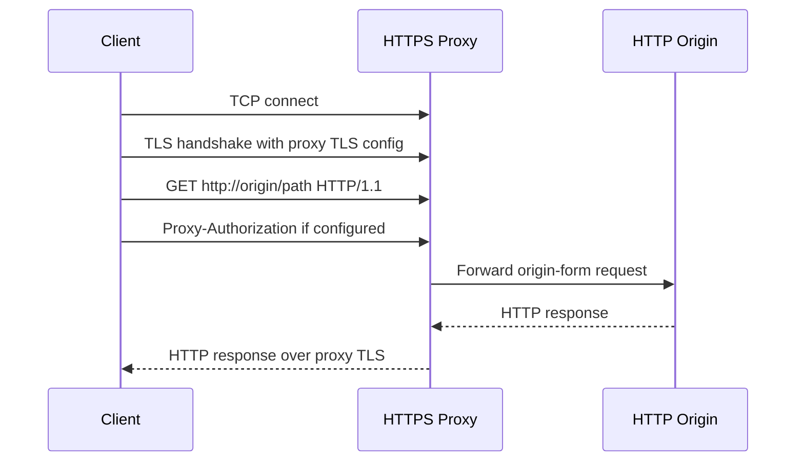
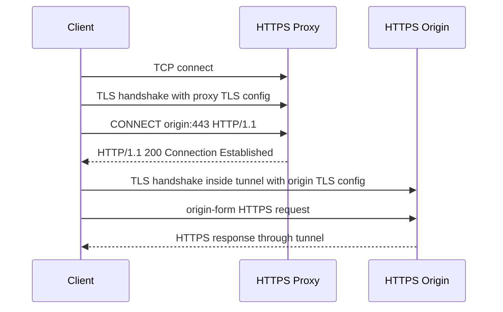

# ylong_http_client HTTPS 代理设计

本文档说明 HTTPS 代理的设计思路、API、数据流、错误边界、规范依据、测试策略和开源参考。

## 目标

HTTPS 代理支持的核心目标：

- 支持代理服务器地址为 `https://host:port`。
- 支持代理服务器 TLS 单向认证：客户端验证代理服务器证书、hostname 和 CA。
- 支持代理服务器 TLS 双向认证：客户端向代理服务器提交客户端证书链和私钥。
- 支持代理服务器 TLS 配置：TLS 版本、CA、客户端证书、私钥、TLS 1.2 cipher list、TLS 1.3 cipher suite、SNI、危险跳过校验选项。
- 保持现有 HTTP proxy 和 HTTPS target over HTTP proxy 行为兼容。
- 将 CONNECT/tunnel/proxy TLS 逻辑抽入独立 proxy transport 模块，便于后续新增代理协议。

非目标：

- v1 不新增 SOCKS、HTTP/2 proxy、系统代理发现。
- v1 不改变 `Proxy::http`、`Proxy::https`、`Proxy::all` 的匹配语义。
- v1 不新增第三方 Rust crate。

## Public API

### `ProxyBuilder::proxy_tls_config`

`proxy_tls_config` 只作用于 HTTPS proxy 的外层 TLS，不影响最终 origin server 的 TLS。

```rust
use ylong_http_client::{Proxy, TlsConfig, TlsFileType};

let proxy_tls = TlsConfig::builder()
    .ca_file("proxy-ca.pem")
    .certificate_chain_file("client-chain.pem")
    .private_key_file("client-key.pem", TlsFileType::PEM)
    .cipher_list("DEFAULT:!aNULL:!eNULL")
    .cipher_suite("TLS_AES_256_GCM_SHA384")
    .build()?;

let proxy = Proxy::all("https://proxy.example:8443")
    .basic_auth("user", "password")
    .proxy_tls_config(proxy_tls)
    .build()?;
```

### `TlsConfigBuilder::private_key_file`

`private_key_file(path, TlsFileType)` 加载客户端私钥。构建 `TlsConfig` 时会检查私钥和当前证书是否匹配。

```rust
use ylong_http_client::{TlsConfig, TlsFileType};

let tls = TlsConfig::builder()
    .certificate_chain_file("client-chain.pem")
    .private_key_file("client-key.pem", TlsFileType::PEM)
    .build()?;
```

### `TlsConfigBuilder::cipher_suite`

`cipher_suite(list)` 配置 TLS 1.3 ciphersuites，格式与 OpenSSL `SSL_CTX_set_ciphersuites` 一致。TLS 1.2 及更早版本继续使用已有 `cipher_list(list)`。

### `ClientBuilder::tls_cipher_suite`

origin TLS 同样可以设置 TLS 1.3 ciphersuites：

```rust
use ylong_http_client::async_impl::ClientBuilder;

let builder = ClientBuilder::new().tls_cipher_suite("TLS_AES_256_GCM_SHA384");
```

## 数据流

### HTTP target + HTTPS proxy



### HTTPS target + HTTPS proxy



## 内部设计

`ProxyInfo` 保存代理服务器 scheme、authority、basic auth 和可选 proxy TLS 配置。

async connector 建连时先匹配代理：

- 如果没有代理，保持直连路径。
- 如果代理 URL 是 `http://`，保持现有 HTTP proxy/CONNECT 路径。
- 如果代理 URL 是 `https://`，先构造 proxy TLS stream，再根据目标 scheme 决定是否 CONNECT。

sync connector 使用相同判断逻辑，并通过 `sync_impl::proxy::{connect_tls, tunnel}` 复用阻塞 TLS/tunnel 辅助函数。

TLS stream 形态：

- async `MixStream::ProxyHttps(AsyncSslStream<TcpStream>)`：HTTP target over HTTPS proxy。
- async `MixStream::HttpsOverProxy(AsyncSslStream<AsyncSslStream<TcpStream>>)`：HTTPS target over HTTPS proxy。
- sync `MixStream::ProxyHttps(SslStream<TcpStream>)`：HTTP target over HTTPS proxy。
- sync `MixStream::HttpsOverProxy(SslStream<SslStream<TcpStream>>)`：HTTPS target over HTTPS proxy。

## 错误边界

- proxy TLS 握手失败返回 `ErrorKind::Connect` 下的 TLS error。
- CONNECT 返回 407 时返回 proxy authentication required。
- CONNECT 响应头超过 8192 字节时返回 proxy headers too long。
- origin TLS 失败必须归因于 origin TLS，不应误用 proxy host 或 proxy CA。
- HTTP target over proxy 不能走 CONNECT；它必须在代理连接内发送 absolute-form request target。

## 规范依据

- RFC 9110 定义 CONNECT 语义：CONNECT 请求让代理和目标服务器建立 tunnel。
- RFC 9110 定义 `Proxy-Authorization` 用于向代理认证。
- RFC 9112 定义 HTTP/1.1 request target，客户端向 proxy 发请求时使用 absolute-form。
- RFC 8446 定义 TLS 1.3 的 CertificateRequest/Certificate 交互，支撑代理 mTLS。
- OpenSSL `SSL_CTX_use_certificate_file`、`SSL_CTX_use_PrivateKey_file`、`SSL_CTX_check_private_key` 支撑客户端证书和私钥加载。
- OpenSSL `SSL_CTX_set_cipher_list`、`SSL_CTX_set_ciphersuites` 分别支撑 TLS 1.2- 和 TLS 1.3 cipher 配置。

参考链接：

- https://www.rfc-editor.org/rfc/rfc9110.html#name-connect
- https://www.rfc-editor.org/rfc/rfc9110.html#field.proxy-authorization
- https://www.rfc-editor.org/rfc/rfc9112.html#name-request-target
- https://www.rfc-editor.org/rfc/rfc8446.html#section-4.3.2
- https://www.rfc-editor.org/rfc/rfc8446.html#section-4.4.2
- https://docs.openssl.org/3.0/man3/SSL_CTX_use_certificate/
- https://docs.openssl.org/3.0/man3/SSL_CTX_set_cipher_list/

## 测试策略

没有现成、完整、专门覆盖 HTTPS forward proxy、proxy mTLS 和 ylong_http_client API 语义的开源 test suite。项目验收采用自建 SDV 分层测试，外部套件只作为 TLS/proxy 行为参考。

当前 SDV 覆盖以下能力，async/sync 两套实现均有同构用例：

| 类别 | 覆盖点 |
| --- | --- |
| 成功路径 | HTTP target over HTTPS proxy；HTTPS target over HTTPS proxy；proxy mTLS 成功 |
| 代理协议字节 | HTTP target 使用 absolute-form；HTTPS target 使用 `CONNECT host:port`；CONNECT 2xx 响应中的 `Content-Length` / `Transfer-Encoding` 被忽略 |
| 认证隔离 | `Proxy-Authorization` 出现在 proxy request / CONNECT request，不进入 tunnel 内 origin request |
| proxy TLS 失败 | 不受信 CA；hostname mismatch；缺失 client cert；错误 client cert CA；client cert/key 不匹配；TLS version mismatch；TLS 1.3 cipher suite mismatch |
| TLS 配置隔离 | proxy TLS 设置 `danger_accept_invalid_certs` / `danger_accept_invalid_hostnames` 时，只影响代理 TLS，不放宽 origin TLS |
| 模块/连接池 | proxy-aware pool key 单元测试覆盖 direct/proxied/no_proxy/clone/不同 proxy identity |

核心命令：

```bash
cargo test -p ylong_http_client --features "async http1_1 ylong_base c_openssl_3_0" --test sdv_async_https_proxy -- --nocapture
cargo test -p ylong_http_client --features "sync http1_1 tokio_base c_openssl_3_0" --test sdv_sync_https_proxy -- --nocapture
```

HTTP-only proxy 回归测试应使用非 TLS feature 组合运行，避免既有 OpenSSL FFI 测试链接限制影响 HTTP-only 用例：

```bash
cargo test -p ylong_http_client --features "async http1_1 ylong_base" --test sdv_async_http_proxy -- --nocapture
```

benchmark 和 differential test 使用 `tools/https_proxy_bench`：

```bash
REPEAT=5 tools/https_proxy_bench/run_https_proxy_bench.sh \
  --url http://127.0.0.1:18080/ \
  --proxy https://localhost:18443 \
  --proxy-ca-file target/https_proxy_bench/certs/ca.pem \
  --method POST \
  --body-size 1048576 \
  --requests 10000 \
  --concurrency 64
```

## 开源实现参考

- libcurl 将 HTTPS proxy 作为代理传输协议处理，并提供独立 proxy TLS 配置：`CURLOPT_PROXY_CAINFO`、`CURLOPT_PROXY_SSL_VERIFYPEER`、`CURLOPT_PROXY_SSLCERT`、`CURLOPT_PROXY_SSLKEY`、`CURLOPT_PROXY_SSL_CIPHER_LIST`、`CURLOPT_PROXY_TLS13_CIPHERS`。
- reqwest/hyper 将 proxy matcher、CONNECT tunnel、proxy TLS 和 origin TLS 分层处理，是当前模块边界的主要参考。

## 外部测试套件定位

- badssl：适合补充证书错误、wrong host、自签名、过期证书等 TLS 证书场景；不是 HTTPS proxy 协议测试。
- BetterTLS：适合更深的 TLS client 证书路径构建和 name constraints 测试；不是 proxy 行为测试。
- tlsfuzzer / BoringSSL BoGo：适合 TLS 协议异常和兼容性测试；接入 HTTP client proxy 需要额外 harness。
- curl test suite：可借鉴 proxy 测试思想和外部 proxy 运行方式；不能直接作为 ylong_http_client 的通用验收套件。

参考链接：

- https://everything.curl.dev/usingcurl/proxies/https
- https://curl.se/libcurl/c/CURLOPT_PROXY.html
- https://curl.se/libcurl/c/CURLOPT_PROXY_CAINFO.html
- https://curl.se/libcurl/c/CURLOPT_PROXY_SSL_VERIFYPEER.html
- https://curl.se/libcurl/c/CURLOPT_PROXY_SSLCERT.html
- https://curl.se/libcurl/c/CURLOPT_PROXY_SSLKEY.html
- https://curl.se/libcurl/c/CURLOPT_PROXY_SSL_CIPHER_LIST.html
- https://curl.se/libcurl/c/CURLOPT_PROXY_TLS13_CIPHERS.html
- https://github.com/seanmonstar/reqwest/blob/04a216fc/src/connect.rs
- https://github.com/chromium/badssl.com
- https://bettertls.com/
- https://github.com/tlsfuzzer/tlsfuzzer
- https://boringssl.googlesource.com/boringssl/+/master/ssl/test/README.md
- https://curl.se/dev/runtests.html
