# HTTPS 代理项目 Roadmap 与 OKR

本文档记录 HTTPS 代理能力的 OKR、阶段状态、验收标准、测试命令和后续风险。

## OKR 总览

| Objective | Key Results | 当前状态 |
| --- | --- | --- |
| O1：补齐 HTTPS proxy 基础能力 | OpenSSL 支持 proxy TLS/mTLS；独立 proxy TLS 配置；async/sync HTTP target over HTTPS proxy；async/sync HTTPS target over HTTPS proxy；hostname、CA、mTLS、cert/key、TLS version/cipher、CONNECT、origin TLS 隔离测试覆盖 | 已完成 conformance hardening |
| O2：代理功能模块化 | CONNECT tunnel 从 connector 内抽出；async/sync proxy transport 独立模块；代理元数据统一沉淀到 `util::proxy`；连接池 key 纳入 proxy identity；文档记录新增协议扩展入口 | 已完成 v1 + pool key hardening |
| O3：规范、测试、可用性文档 | 对齐 RFC 9110、RFC 9112、RFC 8446、OpenSSL、libcurl；记录开源 TLS/proxy 测试套件定位；提供 API 文档、使用指南、架构图、测试命令 | 已完成矩阵更新 |
| O4a：HTTP target over HTTPS proxy 性能验收 | 复用 ylong/libcurl HTTPS proxy benchmark harness；HTTP target 场景 5 次中至少 4 次达到 20%+；记录环境、命令和结果 | 已完成；5/5 达标 |
| O4b：HTTPS target over HTTPS proxy / CONNECT 高压性能验收 | 聚焦 outer proxy TLS + CONNECT + inner origin TLS + 1 MiB body drain；CONNECT 严格场景 5 次中至少 4 次达到 20%+；补齐 per-request/per-connection profiling | 未完成；当前重点是 response first-byte tail、off-CPU 调度、双层 TLS readiness |

## 阶段架构图

### P0 开始规划时

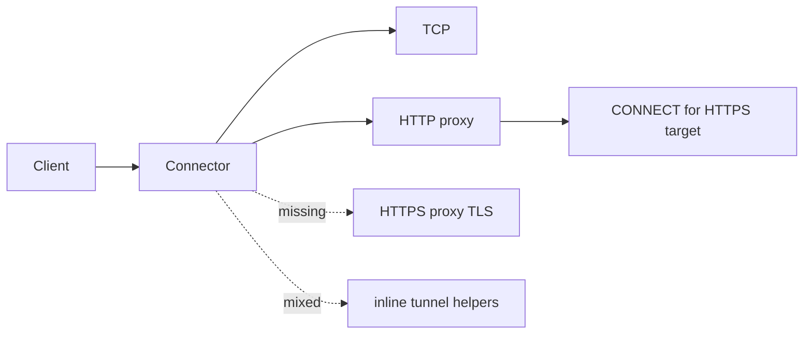
```mermaid
flowchart LR
    Client[Client] --> Connector[Connector]
    Connector --> Tcp[TCP]
    Connector --> HttpProxy[HTTP proxy]
    HttpProxy --> Connect[CONNECT for HTTPS target]
    Connector -. missing .-> HttpsProxy[HTTPS proxy TLS]
    Connector -. mixed .-> TunnelHelpers[inline tunnel helpers]
```

### P1 子任务 1 完成后

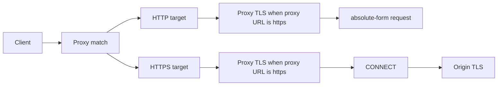
```mermaid
flowchart LR
    Client[Client] --> ProxyMatch[Proxy match]
    ProxyMatch --> HttpTarget[HTTP target]
    ProxyMatch --> HttpsTarget[HTTPS target]
    HttpTarget --> ProxyTls[Proxy TLS when proxy URL is https]
    ProxyTls --> AbsReq[absolute-form request]
    HttpsTarget --> ProxyTls2[Proxy TLS when proxy URL is https]
    ProxyTls2 --> Connect[CONNECT]
    Connect --> OriginTls[Origin TLS]
```

### P2 模块化完成后

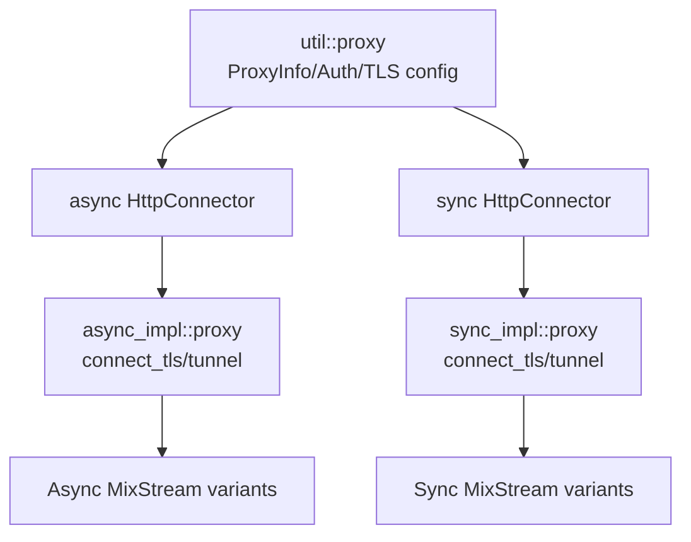
```mermaid
flowchart TB
    UtilProxy[util::proxy<br/>ProxyInfo/Auth/TLS config] --> AsyncConnector[async HttpConnector]
    UtilProxy --> SyncConnector[sync HttpConnector]
    AsyncConnector --> AsyncProxy[async_impl::proxy<br/>connect_tls/tunnel]
    SyncConnector --> SyncProxy[sync_impl::proxy<br/>connect_tls/tunnel]
    AsyncProxy --> AsyncMix[Async MixStream variants]
    SyncProxy --> SyncMix[Sync MixStream variants]
```

### P3 benchmark/profiling 目标形态

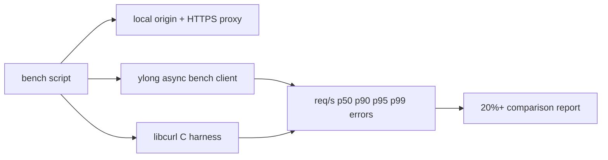
```mermaid
flowchart LR
    Harness[bench script] --> Fixture[local origin + HTTPS proxy]
    Harness --> Ylong[ylong async bench client]
    Harness --> Curl[libcurl C harness]
    Ylong --> Metrics[req/s p50 p90 p95 p99 errors]
    Curl --> Metrics
    Metrics --> Report[20%+ comparison report]
```

### P4 conformance hardening 完成后

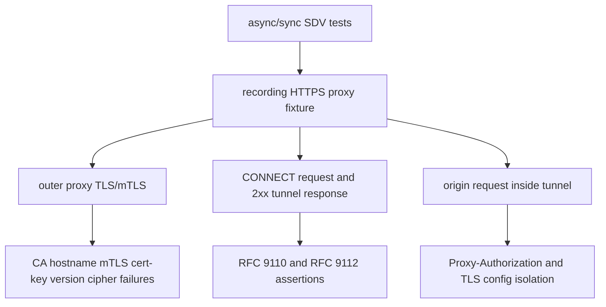
```mermaid
flowchart TB
    Tests[async/sync SDV tests] --> Recording[recording HTTPS proxy fixture]
    Recording --> ProxyTls[outer proxy TLS/mTLS]
    Recording --> Connect[CONNECT request and 2xx tunnel response]
    Recording --> OriginReq[origin request inside tunnel]
    ProxyTls --> Failures[CA hostname mTLS cert-key version cipher failures]
    Connect --> RFC[RFC 9110 and RFC 9112 assertions]
    OriginReq --> Isolation[Proxy-Authorization and TLS config isolation]
```

### P5 formal benchmark 目标形态

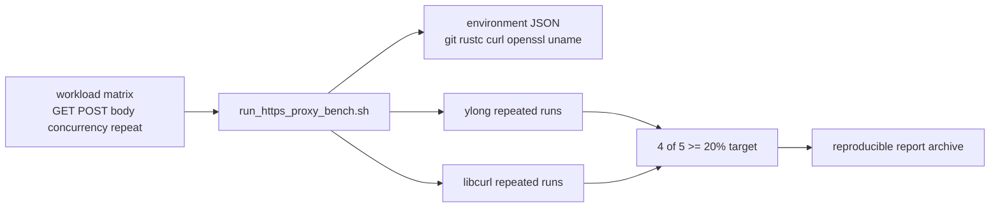
```mermaid
flowchart LR
    Matrix[workload matrix<br/>GET POST body concurrency repeat] --> Runner[run_https_proxy_bench.sh]
    Runner --> Env[environment JSON<br/>git rustc curl openssl uname]
    Runner --> YlongRun[ylong repeated runs]
    Runner --> CurlRun[libcurl repeated runs]
    YlongRun --> Compare[4 of 5 >= 20% target]
    CurlRun --> Compare
    Compare --> Archive[reproducible report archive]
```

### P6 benchmark 归档完成后

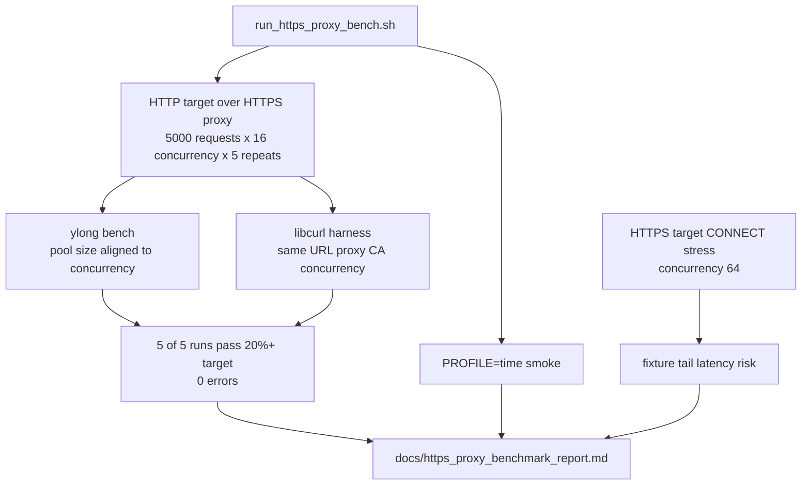
```mermaid
flowchart TB
    Runner[run_https_proxy_bench.sh] --> Workload[HTTP target over HTTPS proxy<br/>5000 requests x 16 concurrency x 5 repeats]
    Workload --> Ylong[ylong bench<br/>pool size aligned to concurrency]
    Workload --> Curl[libcurl harness<br/>same URL proxy CA concurrency]
    Ylong --> Result[5 of 5 runs pass 20%+ target<br/>0 errors]
    Curl --> Result
    Result --> Report[docs/https_proxy_benchmark_report.md]
    Runner --> Profile[PROFILE=time smoke]
    Profile --> Report
    Stress[HTTPS target CONNECT stress<br/>concurrency 64] --> Risk[fixture tail latency risk]
    Risk --> Report
```

### P7 native fixture 与 CONNECT 优化复测后

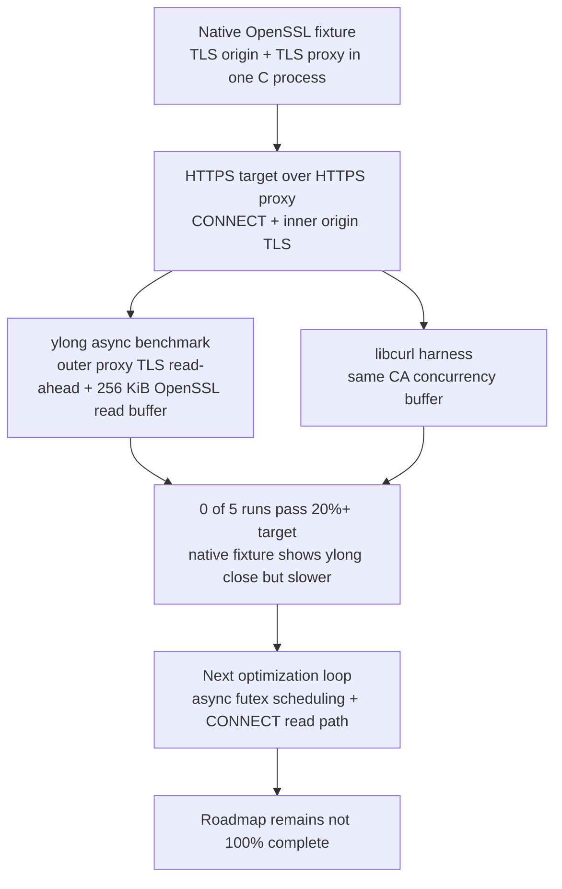
```mermaid
flowchart TB
    Native[Native OpenSSL fixture<br/>TLS origin + TLS proxy in one C process] --> Connect[HTTPS target over HTTPS proxy<br/>CONNECT + inner origin TLS]
    Connect --> Ylong[ylong async benchmark<br/>outer proxy TLS read-ahead + 256 KiB OpenSSL read buffer]
    Connect --> Curl[libcurl harness<br/>same CA concurrency buffer]
    Ylong --> Result[0 of 5 runs pass 20%+ target<br/>native fixture shows ylong close but slower]
    Curl --> Result
    Result --> Next[Next optimization loop<br/>async futex scheduling + CONNECT read path]
    Next --> Roadmap[Roadmap remains not 100% complete]
```

### P8 CONNECT read-ahead 复核后

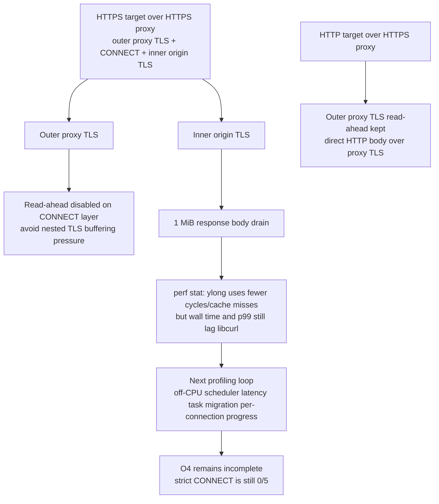
```mermaid
flowchart TB
    Connect[HTTPS target over HTTPS proxy<br/>outer proxy TLS + CONNECT + inner origin TLS] --> ProxyTls[Outer proxy TLS]
    Connect --> OriginTls[Inner origin TLS]
    HttpTarget[HTTP target over HTTPS proxy] --> ProxyReadAhead[Outer proxy TLS read-ahead kept<br/>direct HTTP body over proxy TLS]
    ProxyTls --> NoReadAhead[Read-ahead disabled on CONNECT layer<br/>avoid nested TLS buffering pressure]
    OriginTls --> BodyDrain[1 MiB response body drain]
    BodyDrain --> Perf[perf stat: ylong uses fewer cycles/cache misses<br/>but wall time and p99 still lag libcurl]
    Perf --> Next[Next profiling loop<br/>off-CPU scheduler latency task migration per-connection progress]
    Next --> Status[O4 remains incomplete<br/>strict CONNECT is still 0/5]
```

### P9 CONNECT read-ahead buffer 调优后

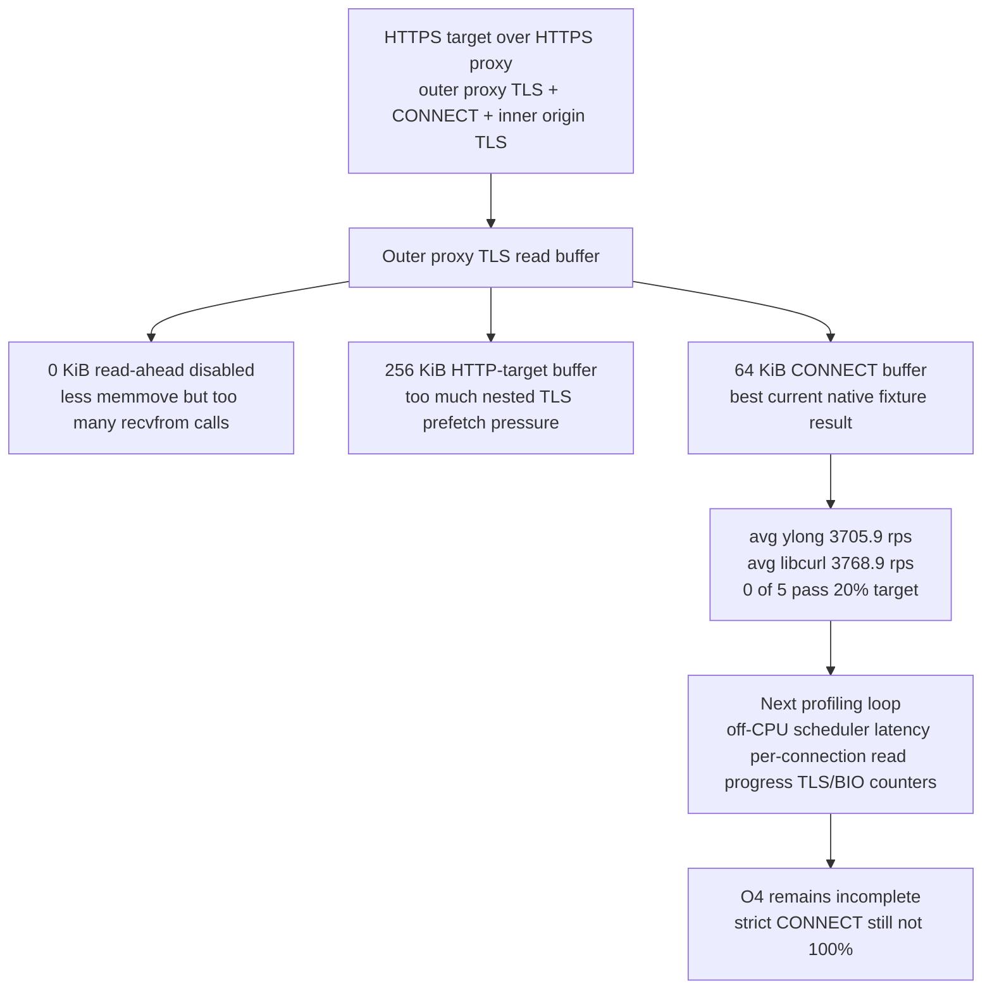
```mermaid
flowchart TB
    Connect[HTTPS target over HTTPS proxy<br/>outer proxy TLS + CONNECT + inner origin TLS] --> Buffer[Outer proxy TLS read buffer]
    Buffer --> Disabled[0 KiB read-ahead disabled<br/>less memmove but too many recvfrom calls]
    Buffer --> Full[256 KiB HTTP-target buffer<br/>too much nested TLS prefetch pressure]
    Buffer --> Tuned[64 KiB CONNECT buffer<br/>best current native fixture result]
    Tuned --> Result[avg ylong 3705.9 rps<br/>avg libcurl 3768.9 rps<br/>0 of 5 pass 20% target]
    Result --> Next[Next profiling loop<br/>off-CPU scheduler latency per-connection read progress TLS/BIO counters]
    Next --> Status[O4 remains incomplete<br/>strict CONNECT still not 100%]
```

### P10 body-read instrumentation 后

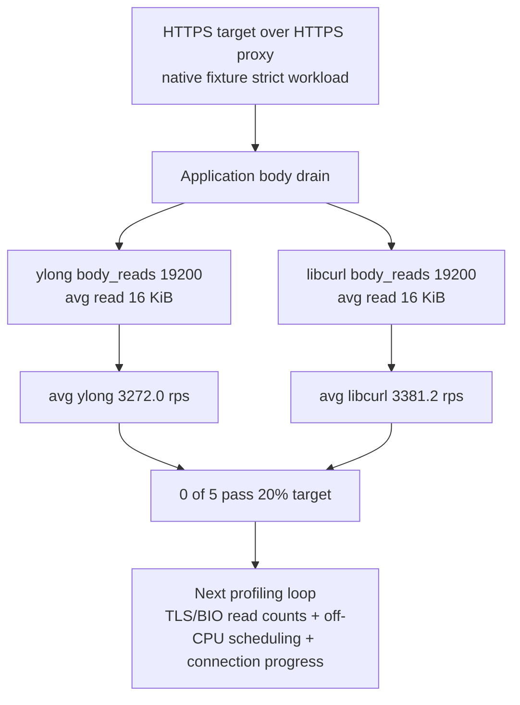
```mermaid
flowchart TB
    Connect[HTTPS target over HTTPS proxy<br/>native fixture strict workload] --> Drain[Application body drain]
    Drain --> YlongReads[ylong body_reads 19200<br/>avg read 16 KiB]
    Drain --> CurlReads[libcurl body_reads 19200<br/>avg read 16 KiB]
    YlongReads --> Result[avg ylong 3272.0 rps]
    CurlReads --> Result2[avg libcurl 3381.2 rps]
    Result --> Status[0 of 5 pass 20% target]
    Result2 --> Status
    Status --> Next[Next profiling loop<br/>TLS/BIO read counts + off-CPU scheduling + connection progress]
```

### P11 ylong runtime 对照后

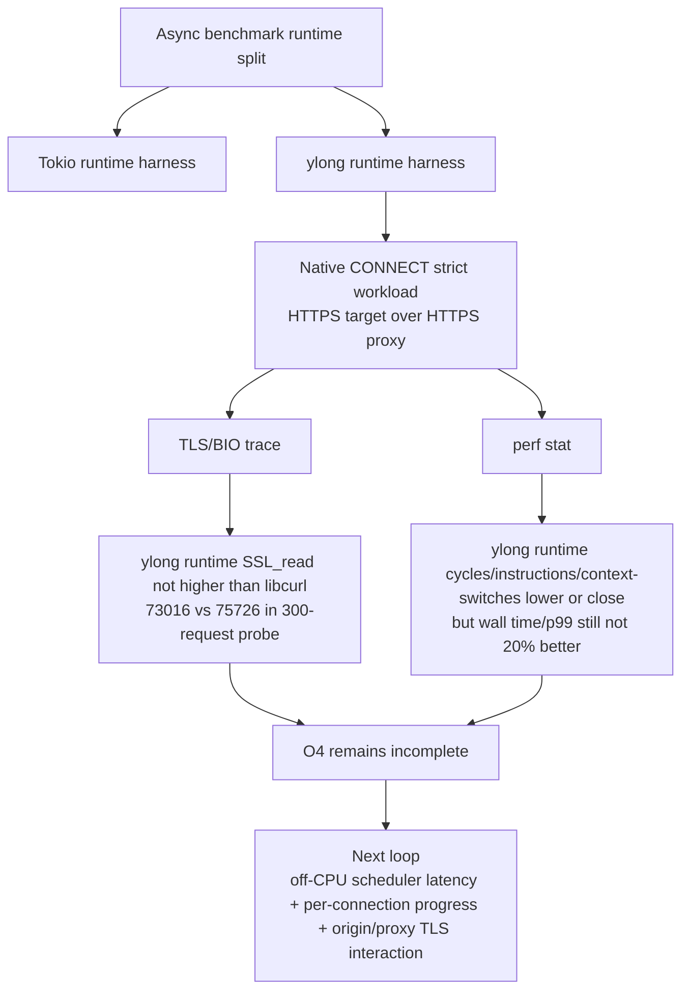
```mermaid
flowchart TB
    Runtime[Async benchmark runtime split] --> Tokio[Tokio runtime harness]
    Runtime --> YlongRt[ylong runtime harness]
    YlongRt --> Strict[Native CONNECT strict workload<br/>HTTPS target over HTTPS proxy]
    Strict --> Trace[TLS/BIO trace]
    Strict --> Perf[perf stat]
    Trace --> Finding1[ylong runtime SSL_read not higher than libcurl<br/>73016 vs 75726 in 300-request probe]
    Perf --> Finding2[ylong runtime cycles/instructions/context-switches lower or close<br/>but wall time/p99 still not 20% better]
    Finding1 --> Status[O4 remains incomplete]
    Finding2 --> Status
    Status --> Next[Next loop<br/>off-CPU scheduler latency + per-connection progress + origin/proxy TLS interaction]
```

### P12 worker 级进度观测后

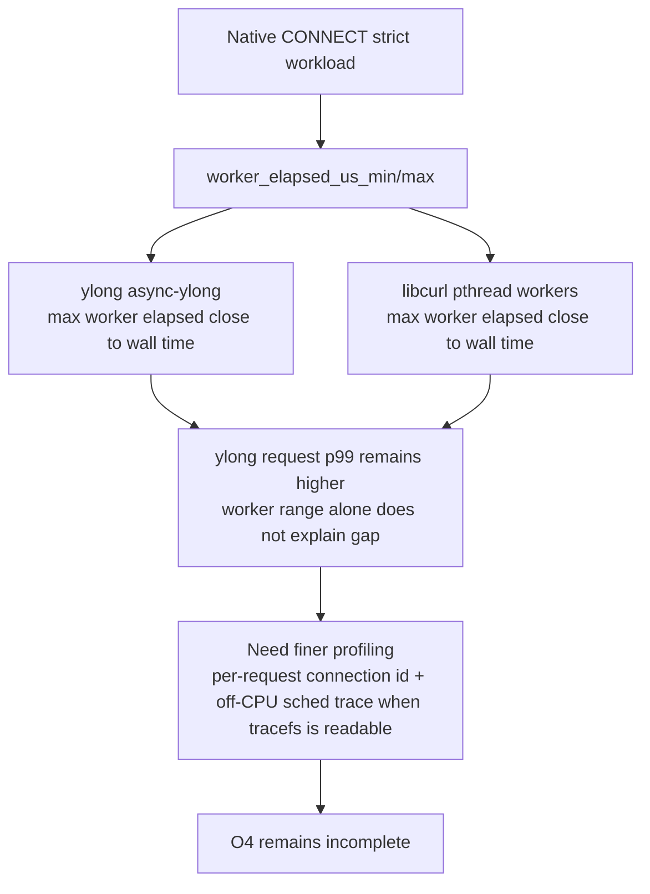
```mermaid
flowchart TB
    Strict[Native CONNECT strict workload] --> WorkerMetrics[worker_elapsed_us_min/max]
    WorkerMetrics --> Ylong[ylong async-ylong<br/>max worker elapsed close to wall time]
    WorkerMetrics --> Curl[libcurl pthread workers<br/>max worker elapsed close to wall time]
    Ylong --> Tail[ylong request p99 remains higher<br/>worker range alone does not explain gap]
    Curl --> Tail
    Tail --> Next[Need finer profiling<br/>per-request connection id + off-CPU sched trace when tracefs is readable]
    Next --> Status[O4 remains incomplete]
```

### P13 CONNECT 高压目标收敛后

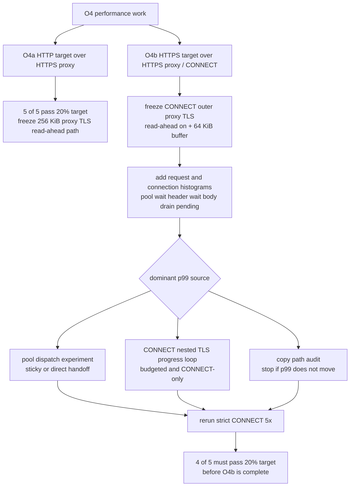
```mermaid
flowchart TB
    O4[O4 performance work] --> O4a[O4a HTTP target over HTTPS proxy]
    O4 --> O4b[O4b HTTPS target over HTTPS proxy / CONNECT]
    O4a --> Done[5 of 5 pass 20% target<br/>freeze 256 KiB proxy TLS read-ahead path]
    O4b --> Frozen[freeze CONNECT outer proxy TLS<br/>read-ahead on + 64 KiB buffer]
    Frozen --> Trace[add request and connection histograms<br/>pool wait header wait body drain pending]
    Trace --> Decide{dominant p99 source}
    Decide --> Pool[pool dispatch experiment<br/>sticky or direct handoff]
    Decide --> Body[CONNECT nested TLS progress loop<br/>budgeted and CONNECT-only]
    Decide --> Copy[copy path audit<br/>stop if p99 does not move]
    Pool --> Strict[rerun strict CONNECT 5x]
    Body --> Strict
    Copy --> Strict
    Strict --> Gate[4 of 5 must pass 20% target<br/>before O4b is complete]
```

### P14 CONNECT response-wait profiling 后

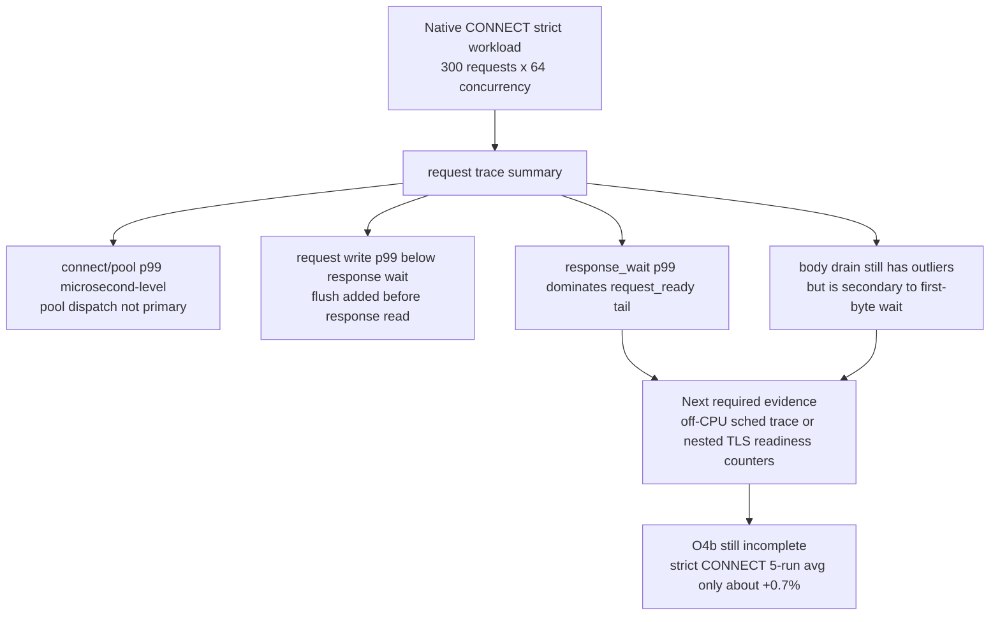
```mermaid
flowchart TB
    Strict[Native CONNECT strict workload<br/>300 requests x 64 concurrency] --> Trace[request trace summary]
    Trace --> Pool[connect/pool p99 microsecond-level<br/>pool dispatch not primary]
    Trace --> Write[request write p99 below response wait<br/>flush added before response read]
    Trace --> Wait[response_wait p99 dominates request_ready tail]
    Trace --> Body[body drain still has outliers<br/>but is secondary to first-byte wait]
    Wait --> Next[Next required evidence<br/>off-CPU sched trace or nested TLS readiness counters]
    Body --> Next
    Next --> Status[O4b still incomplete<br/>strict CONNECT 5-run avg only about +0.7%]
```

### P15 ready-drain 与热连接复用实验后

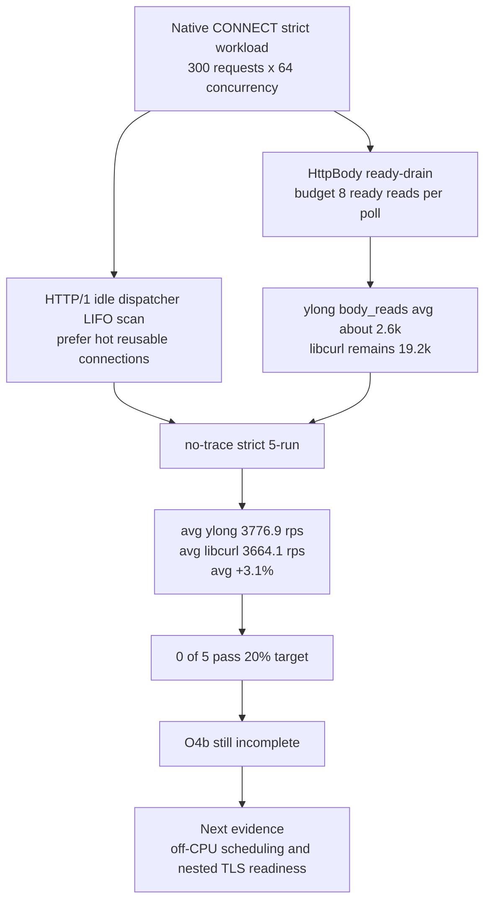
```mermaid
flowchart TB
    Strict[Native CONNECT strict workload<br/>300 requests x 64 concurrency] --> BodyReady[HttpBody ready-drain<br/>budget 8 ready reads per poll]
    Strict --> PoolHot[HTTP/1 idle dispatcher LIFO scan<br/>prefer hot reusable connections]
    BodyReady --> Reads[ylong body_reads avg about 2.6k<br/>libcurl remains 19.2k]
    PoolHot --> Bench[no-trace strict 5-run]
    Reads --> Bench
    Bench --> Result[avg ylong 3776.9 rps<br/>avg libcurl 3664.1 rps<br/>avg +3.1%]
    Result --> Gate[0 of 5 pass 20% target]
    Gate --> Status[O4b still incomplete]
    Status --> Next[Next evidence<br/>off-CPU scheduling and nested TLS readiness]
```

### P16 CONNECT 内层 origin TLS read-ahead 与负实验后

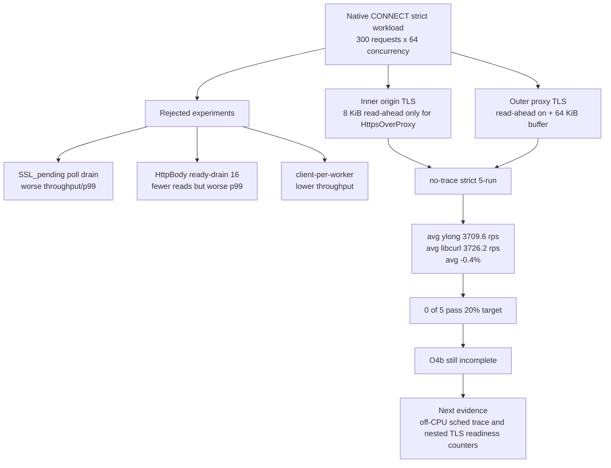
```mermaid
flowchart TB
    Strict[Native CONNECT strict workload<br/>300 requests x 64 concurrency] --> Outer[Outer proxy TLS<br/>read-ahead on + 64 KiB buffer]
    Strict --> Inner[Inner origin TLS<br/>8 KiB read-ahead only for HttpsOverProxy]
    Strict --> Negative[Rejected experiments]
    Negative --> PendingDrain[SSL_pending poll drain<br/>worse throughput/p99]
    Negative --> Drain16[HttpBody ready-drain 16<br/>fewer reads but worse p99]
    Negative --> Sticky[client-per-worker<br/>lower throughput]
    Inner --> Bench[no-trace strict 5-run]
    Outer --> Bench
    Bench --> Result[avg ylong 3709.6 rps<br/>avg libcurl 3726.2 rps<br/>avg -0.4%]
    Result --> Gate[0 of 5 pass 20% target]
    Gate --> Status[O4b still incomplete]
    Status --> Next[Next evidence<br/>off-CPU sched trace and nested TLS readiness counters]
```

### P17 off-CPU profiling 尝试后

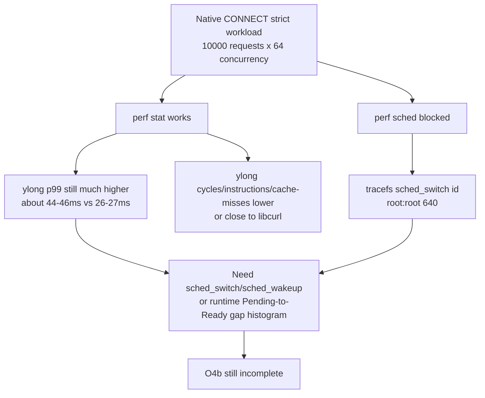
```mermaid
flowchart TB
    Strict[Native CONNECT strict workload<br/>10000 requests x 64 concurrency] --> PerfStat[perf stat works]
    Strict --> PerfSched[perf sched blocked]
    PerfSched --> Tracefs[tracefs sched_switch id<br/>root:root 640]
    PerfStat --> Cpu[ylong cycles/instructions/cache-misses lower<br/>or close to libcurl]
    PerfStat --> Tail[ylong p99 still much higher<br/>about 44-46ms vs 26-27ms]
    Tail --> OffCpu[Need sched_switch/sched_wakeup<br/>or runtime Pending-to-Ready gap histogram]
    Tracefs --> OffCpu
    OffCpu --> Status[O4b still incomplete]
```

## M1 TLS 配置补齐

状态：已完成。

实现：

- 增加 OpenSSL FFI：`SSL_CTX_use_PrivateKey_file`、`SSL_CTX_check_private_key`、`SSL_CTX_set_ciphersuites`。
- 增加 `TlsConfigBuilder::private_key_file`。
- 增加 `TlsConfigBuilder::cipher_suite`。
- 增加 async/sync `ClientBuilder::tls_cipher_suite`。
- 构建 `TlsConfig` 时检查客户端证书和私钥匹配。
- 增加 TLS config 单元测试。

验收：

```bash
cargo check -p ylong_http_client --features "async http1_1 tokio_base c_openssl_3_0"
```

## M2 HTTPS Proxy 主路径

状态：已完成 async/sync，并补齐 conformance hardening。

实现：

- `ProxyBuilder::proxy_tls_config` 支持为代理服务器设置独立 TLS 配置。
- `http://` proxy 保持兼容。
- `https://` proxy 支持 HTTP target absolute-form 请求。
- `https://` proxy 支持 HTTPS target 的 proxy TLS + CONNECT + origin TLS。
- HTTP target 经过代理时写入 `Proxy-Authorization`。
- sync 和 async 均支持 `ProxyHttps` 与 `HttpsOverProxy` stream。
- CONNECT 成功响应中的 `Content-Length` / `Transfer-Encoding` 被忽略，进入 tunnel 后再执行 origin TLS。
- `Proxy-Authorization` 只出现在 proxy request / CONNECT request，不进入 origin request。
- proxy TLS 的危险跳过校验只作用于代理 TLS，不影响 origin TLS。

验收：

```bash
cargo check -p ylong_http_client --features "async http1_1 tokio_base c_openssl_3_0"
cargo check -p ylong_http_client --features "async http1_1 ylong_base c_openssl_3_0"
cargo test -p ylong_http_client --features "async http1_1 ylong_base c_openssl_3_0" --test sdv_async_https_proxy -- --nocapture
cargo test -p ylong_http_client --features "async http1_1 ylong_base" --test sdv_async_http_proxy -- --nocapture
cargo check -p ylong_http_client --features "sync http1_1 tokio_base c_openssl_3_0"
cargo test -p ylong_http_client --features "sync http1_1 tokio_base c_openssl_3_0" --test sdv_sync_https_proxy -- --nocapture
```

## M3 代理模块化

状态：已完成 v1，并完成连接池 key hardening。

实现：

- `async_impl::proxy` 承载 async proxy TLS 和 CONNECT tunnel。
- `sync_impl::proxy` 承载 sync proxy TLS 和 CONNECT tunnel。
- `util::proxy::ProxyInfo` 统一保存 proxy scheme、authority、basic auth 和 proxy TLS config。
- connector 只负责根据目标 scheme 和代理 scheme 编排 transport 顺序。
- 连接池 key 已纳入 target scheme/authority 和 proxy identity，避免不同 proxy 配置错误复用连接。

新增代理协议的推荐路径：

1. 在 `util::proxy` 扩展代理协议元数据和 builder API。
2. 在 `async_impl::proxy` / `sync_impl::proxy` 增加协议握手函数。
3. 在 connector 中新增协议分支，只做编排，不内联协议细节。
4. 为每种目标 scheme 增加 SDV 测试和失败路径测试。

## M4 文档与示例

状态：已完成基础文档和 async 示例。

交付物：

- `docs/architecture.md`：项目架构、请求生命周期、切入点。
- `docs/https_proxy_design.md`：设计思路、API、数据流、错误边界、规范和测试。
- `docs/https_proxy_roadmap.md`：OKR、阶段状态、Mermaid 架构图、验收命令。
- `docs/user_guide.md`：HTTPS proxy 使用说明。
- `ylong_http_client/examples/async_https_proxy.rs`：代理 TLS/mTLS 示例。

## M5 性能对比

状态：benchmark/profiling harness 已落地，HTTP target over HTTPS proxy 正式报告已归档；HTTPS target over HTTPS proxy 的 CONNECT 高压验收未达标。

目标：HTTPS proxy 场景下 ylong_http_client HTTP 请求性能比 libcurl 高 20%+。

benchmark 场景：

- 本地 HTTPS proxy + 本地 HTTP origin。
- 本地 HTTPS proxy + 本地 HTTPS origin。
- keep-alive 开启，分别测连接复用和短连接。
- 并发级别：1、8、32、128、256。
- 请求数：1k、10k、100k。
- 响应体：空 body、小 body、固定 16 KiB body、1 MiB body。
- 请求体：GET 空 body、POST 1 MiB / 10 MiB body。

指标：

- 吞吐量 requests/sec。
- P50/P90/P95/P99 latency。
- 错误数。
- CPU 使用率。
- TCP/TLS/CONNECT 建连次数。
- 连接池复用率。

实现要求：

- 不引入第三方 Rust crate。
- ylong_http_client 和 libcurl 使用相同 origin/proxy/并发/请求数。
- `ylong_http_client/examples/async_https_proxy_bench.rs` 负责 ylong 侧请求压测。
- `ylong_http_client/examples/async_ylong_https_proxy_bench.rs` 复用同一请求逻辑，用 `ylong_base` 构建 ylong runtime 对照入口。
- `tools/https_proxy_bench/libcurl_harness.c` 负责 libcurl API 对比。
- `tools/https_proxy_bench/run_https_proxy_bench.sh` 统一构建并运行两侧 workload；输出环境 JSON；`REPEAT=5` 可重复运行；`YLONG_CLIENT=async|async-ylong|sync|both` 可选择 ylong 侧实现；若系统缺少 `curl-config` 或 `cc`，脚本跳过 libcurl 并说明原因。
- `tools/https_proxy_bench/local_https_proxy.py` 提供本地 HTTP origin + HTTPS proxy fixture，支持 GET/POST 和固定响应体。
- `tools/https_proxy_bench/native_proxy_fixture.c` 提供原生 OpenSSL TLS origin + TLS proxy fixture，用于移除 `socat` 包装进程对 CONNECT 高压结果的影响。
- profiling 使用 `perf stat`、`perf record -g --call-graph dwarf` 或 `/usr/bin/time -v` 包裹同一 workload。
- `docs/https_proxy_benchmark_report.md` 归档正式 5 次对比、profiling smoke、native CONNECT perf 结果和 CONNECT 压测风险。

达标口径：

```text
throughput_improvement = (ylong_rps - libcurl_rps) / libcurl_rps
要求 throughput_improvement >= 20%
或 ylong_time <= libcurl_time / 1.20

正式报告要求：
- REPEAT=5 的同一 workload 至少 4 次达标。
- ylong 错误率不高于 libcurl。
- p99 latency 不超过约定阈值。
- 归档 git commit、rustc、OpenSSL、curl/libcurl、uname、workload 参数。
```

smoke 命令：

```bash
tools/https_proxy_bench/generate_certs.sh target/https_proxy_bench/certs
tools/https_proxy_bench/local_https_proxy.py \
  --cert-file target/https_proxy_bench/certs/server.pem \
  --key-file target/https_proxy_bench/certs/server.key \
  --ca-file target/https_proxy_bench/certs/ca.pem \
  --response-size 128 \
  --origin-port 18080 \
  --proxy-port 18443

tools/https_proxy_bench/run_https_proxy_bench.sh \
  --url http://127.0.0.1:18080/ \
  --proxy https://localhost:18443 \
  --proxy-ca-file target/https_proxy_bench/certs/ca.pem \
  --requests 20 \
  --concurrency 4
```

本地 smoke 结果格式：

```json
{"kind":"bench_environment","repeat":1,"git":"...","rustc":"...","curl":"...","openssl":"...","uname":"..."}
{"client":"ylong_http_client","method":"GET","body_size":0,"completed":20,"errors":0,"bytes":2621440,"body_reads":160,"avg_body_read_size":16384.000,"rps":424.440,"latency_us_p99":1234}
{"client":"libcurl","method":"GET","body_size":0,"completed":20,"errors":0,"bytes":2621440,"body_reads":160,"avg_body_read_size":16384.000,"rps":91.931,"latency_us_p99":5678}
```

CONNECT 高压当前结论：

- `HTTPS target over HTTPS proxy` 的 native OpenSSL fixture 已跑通，能稳定验证 outer proxy TLS、CONNECT、inner origin TLS 和 1 MiB 响应体传输。
- HTTP target over HTTPS proxy 保留 outer proxy TLS 256 KiB read-ahead；HTTPS target over HTTPS proxy 的 CONNECT 外层 proxy TLS 使用 64 KiB read-ahead buffer，避免完全关闭 read-ahead 带来的 syscall 放大，也避免 256 KiB 在嵌套 TLS 下的预读压力。
- native fixture 下 `requests=300`、`warmup=64`、`concurrency=64`、`runtime_threads=16`、`response=1 MiB` 的最新 body-read instrumentation 5 次复测仍为 0/5 达标，ylong 平均约 3272.0 rps，libcurl 平均约 3381.2 rps。
- 真实 `perf stat` / `perf record` 已完成：`requests=10000` 下 ylong async 平均约 3598 rps，libcurl 平均约 3740 rps；ylong cycles、instructions、cache misses 和 context switches 均低于 libcurl，但 wall time 和 p99 仍落后。
- 完全关闭 CONNECT 外层 read-ahead 后，ylong async 的 `__memmove_avx_unaligned_erms` top self 从前序 profile 的约 16.10% 降到约 3.84%，但 `strace -f -c` 显示 `recvfrom` 次数明显放大；64 KiB buffer 是当前最优折中。
- body-read instrumentation 显示 ylong 与 libcurl 的应用层 body drain 都是 16 KiB chunk，严格 CONNECT 未达标不能再归因为 benchmark drain buffer 不一致。
- ylong runtime 对照入口已接入，`requests=300`、`concurrency=64`、`runtime_threads=16` 的 3-run probe 平均约 3772.5 rps，libcurl 平均约 3716.7 rps，仅约 1.5% 提升，未达到 20%。
- TLS/BIO trace 显示 ylong runtime probe 中 `SSL_read` 次数不高于 libcurl（73016 vs 75726），因此当前严格 CONNECT 差距不能简单归因为 ylong 调用了更多 OpenSSL read。
- worker 级 elapsed range 已接入 ylong/libcurl harness；初步结果显示两者最大 worker elapsed 都接近总 wall time，仍需更细粒度的 connection id / off-CPU trace 才能解释 ylong 更高的 request p99。
- request trace summary 已能拆分 `request_ready`、`connect`、`request_write`、`response_wait`、`body_first_byte`、`body_drain`、单次 body read wait；当前严格 CONNECT probe 显示 `connect/pool` 不是主因，`response_wait_p99` 是首要尾延迟来源，body drain 长尾为次要来源。
- HTTP/1 request 写完后已显式 flush 再进入 response read，作为双层 TLS 场景的正确性保护；该改动没有让 strict CONNECT 达到 20% 目标。
- ready-drain 与热连接复用实验已落地：`HttpBody` 在单次 poll 中最多连续消费 8 次 ready read，HTTP/1 idle dispatcher 改为反向扫描以偏向最近热连接。
- ready-drain 使 ylong 在 300 个 1 MiB CONNECT 响应中的 body read 次数从约 19.2k 降到约 2.6k；预算 16 会拉长单次 read wait 并退化，因此不保留。
- CONNECT 内层 origin TLS 现在仅在 `HttpsOverProxy` 路径启用 8 KiB read-ahead；直连 HTTPS、HTTP target over HTTPS proxy、CONNECT 外层 proxy TLS 策略不受影响。
- `SSL_pending` poll 内 drain、`BODY_READY_DRAIN_READS=16` 和 `--client-per-worker` 都已做负实验，结果不支持保留。
- 最新 strict CONNECT no-trace 5-run：ylong async-ylong 平均约 3709.6 rps，libcurl 平均约 3726.2 rps，平均约 -0.4%；5 次提升分别约 +9.6%、-6.3%、-0.1%、-1.4%、-3.1%，仍为 0/5 达到 20%+。
- O4a HTTP target smoke 仍正常：20 request、4 concurrency 下 ylong 约 4753 rps，libcurl 约 1787 rps，说明本阶段没有破坏已完成路径。
- off-CPU profiling 尝试发现当前用户仍无法读取 `/sys/kernel/tracing/events/sched/sched_switch/id`，因此 `perf sched record` 暂时不能运行；降级的 `/usr/bin/time -v` 和 `perf stat` 继续显示 ylong CPU 指标不差但 p99 更高。
- 因此下一阶段重点从继续减少 body read 次数，转为 off-CPU scheduler latency、response first-byte wait、CONNECT 双 TLS readiness 传播和尾延迟归因。
- O4a `HTTP target over HTTPS proxy` 已完成并冻结；后续优化不得扩大到该路径，除非用于回归验证。
- O4b `HTTPS target over HTTPS proxy / CONNECT` 仍未完成；只有严格 CONNECT 场景 5 次中至少 4 次达到 20%+ 后，才能将全部 OKR 标记为 100% 完成。

下一阶段执行顺序：

1. 冻结 HTTP target 256 KiB 与 CONNECT 64 KiB read-ahead 策略。
2. 保留 request/body/pool 阶段 histogram，但正式吞吐验收不启用 `--trace-summary`。
3. 放开 tracefs sched tracepoint 读取权限，或在 runtime/benchmark 内补 Pending-to-Ready gap histogram，确认 p99 差距是否来自 Pending/wake 间隔、任务迁移或双层 TLS readiness 传播。
4. 若 off-CPU 证据指向 nested TLS readiness，再做 CONNECT-only progress loop；若证据指向调度，再收敛 runtime wake/worker 绑定策略；不要再扩大 ready-drain 预算或引入通用 `SSL_pending` drain。
5. 每次优化后复跑 strict CONNECT 5 次，并保留 HTTP target smoke 作为已完成路径的回归保护。

## 风险与后续

- HTTP/2 over HTTPS proxy 需要单独设计 ALPN 和代理请求编码，不能混入当前 HTTP/1.1 tunnel 实现。
- SOCKS/HTTP2 proxy 需要扩展 URI scheme 或新增 proxy protocol enum，目前 v1 仅保留模块边界。
- proxy TLS 和 origin TLS 的证书配置必须保持隔离。
- 长时间高压 benchmark 不应进入默认 CI；CI 只跑短耗时 smoke。
