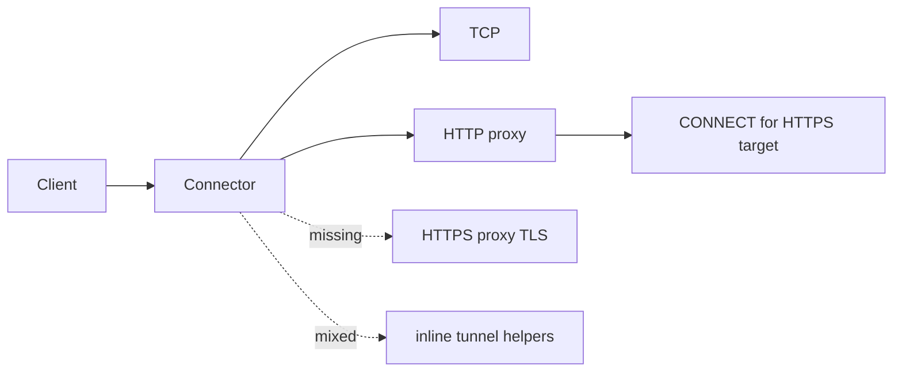
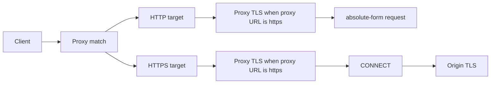
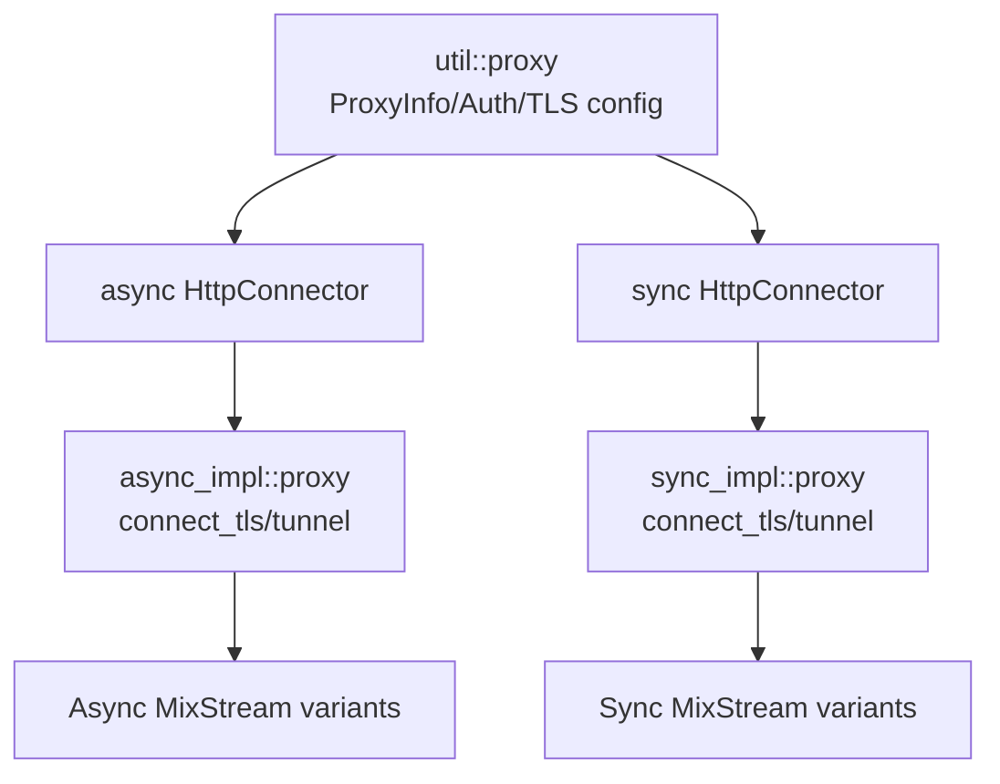
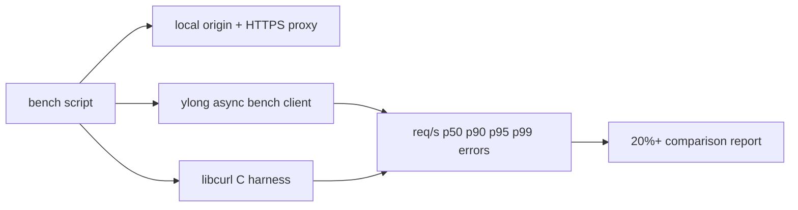
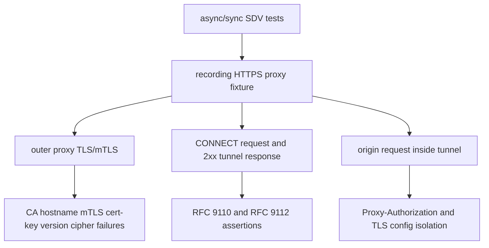
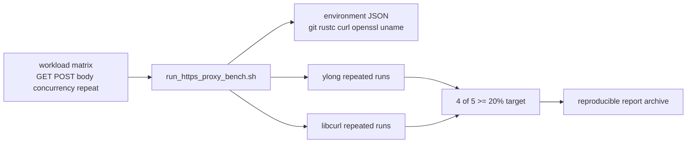

# HTTPS 代理项目 Roadmap 与 OKR

本文档记录 HTTPS 代理能力的 OKR、阶段状态、验收标准、测试命令和后续风险。

## OKR 总览

| Objective | Key Results | 当前状态 |
| --- | --- | --- |
| O1：补齐 HTTPS proxy 基础能力 | OpenSSL 支持 proxy TLS/mTLS；独立 proxy TLS 配置；async/sync HTTP target over HTTPS proxy；async/sync HTTPS target over HTTPS proxy；hostname、CA、mTLS、cert/key、TLS version/cipher、CONNECT、origin TLS 隔离测试覆盖 | 已完成 conformance hardening |
| O2：代理功能模块化 | CONNECT tunnel 从 connector 内抽出；async/sync proxy transport 独立模块；代理元数据统一沉淀到 `util::proxy`；连接池 key 纳入 proxy identity；文档记录新增协议扩展入口 | 已完成 v1 + pool key hardening |
| O3：规范、测试、可用性文档 | 对齐 RFC 9110、RFC 9112、RFC 8446、OpenSSL、libcurl；记录开源 TLS/proxy 测试套件定位；提供 API 文档、使用指南、架构图、测试命令 | 已完成矩阵更新 |
| O4：性能对比和 profiling 体系 | 提供 ylong/libcurl HTTPS proxy benchmark harness；支持 GET/POST、body size、重复运行、环境元数据、高并发、CA/mTLS 参数；记录 20%+ 目标的测量方法 | 已完成 harness，正式长跑待归档 |

## 阶段架构图

### P0 开始规划时



### P1 子任务 1 完成后



### P2 模块化完成后



### P3 benchmark/profiling 目标形态



### P4 conformance hardening 完成后



### P5 formal benchmark 目标形态



## M1 TLS 配置补齐

状态：已完成。

实现：

- 增加 OpenSSL FFI：`SSL_CTX_use_PrivateKey_file`、`SSL_CTX_check_private_key`、`SSL_CTX_set_ciphersuites`。
- 增加 `TlsConfigBuilder::private_key_file`。
- 增加 `TlsConfigBuilder::cipher_suite`。
- 增加 async/sync `ClientBuilder::tls_cipher_suite`。
- 构建 `TlsConfig` 时检查客户端证书和私钥匹配。
- 增加 TLS config 单元测试。

验收：

```bash
cargo check -p ylong_http_client --features "async http1_1 tokio_base c_openssl_3_0"
```

## M2 HTTPS Proxy 主路径

状态：已完成 async/sync，并补齐 conformance hardening。

实现：

- `ProxyBuilder::proxy_tls_config` 支持为代理服务器设置独立 TLS 配置。
- `http://` proxy 保持兼容。
- `https://` proxy 支持 HTTP target absolute-form 请求。
- `https://` proxy 支持 HTTPS target 的 proxy TLS + CONNECT + origin TLS。
- HTTP target 经过代理时写入 `Proxy-Authorization`。
- sync 和 async 均支持 `ProxyHttps` 与 `HttpsOverProxy` stream。
- CONNECT 成功响应中的 `Content-Length` / `Transfer-Encoding` 被忽略，进入 tunnel 后再执行 origin TLS。
- `Proxy-Authorization` 只出现在 proxy request / CONNECT request，不进入 origin request。
- proxy TLS 的危险跳过校验只作用于代理 TLS，不影响 origin TLS。

验收：

```bash
cargo check -p ylong_http_client --features "async http1_1 tokio_base c_openssl_3_0"
cargo check -p ylong_http_client --features "async http1_1 ylong_base c_openssl_3_0"
cargo test -p ylong_http_client --features "async http1_1 ylong_base c_openssl_3_0" --test sdv_async_https_proxy -- --nocapture
cargo test -p ylong_http_client --features "async http1_1 ylong_base" --test sdv_async_http_proxy -- --nocapture
cargo check -p ylong_http_client --features "sync http1_1 tokio_base c_openssl_3_0"
cargo test -p ylong_http_client --features "sync http1_1 tokio_base c_openssl_3_0" --test sdv_sync_https_proxy -- --nocapture
```

## M3 代理模块化

状态：已完成 v1，并完成连接池 key hardening。

实现：

- `async_impl::proxy` 承载 async proxy TLS 和 CONNECT tunnel。
- `sync_impl::proxy` 承载 sync proxy TLS 和 CONNECT tunnel。
- `util::proxy::ProxyInfo` 统一保存 proxy scheme、authority、basic auth 和 proxy TLS config。
- connector 只负责根据目标 scheme 和代理 scheme 编排 transport 顺序。
- 连接池 key 已纳入 target scheme/authority 和 proxy identity，避免不同 proxy 配置错误复用连接。

新增代理协议的推荐路径：

1. 在 `util::proxy` 扩展代理协议元数据和 builder API。
2. 在 `async_impl::proxy` / `sync_impl::proxy` 增加协议握手函数。
3. 在 connector 中新增协议分支，只做编排，不内联协议细节。
4. 为每种目标 scheme 增加 SDV 测试和失败路径测试。

## M4 文档与示例

状态：已完成基础文档和 async 示例。

交付物：

- `docs/architecture.md`：项目架构、请求生命周期、切入点。
- `docs/https_proxy_design.md`：设计思路、API、数据流、错误边界、规范和测试。
- `docs/https_proxy_roadmap.md`：OKR、阶段状态、Mermaid 架构图、验收命令。
- `docs/user_guide.md`：HTTPS proxy 使用说明。
- `ylong_http_client/examples/async_https_proxy.rs`：代理 TLS/mTLS 示例。

## M5 性能对比

状态：benchmark/profiling harness 已落地，长时间高压数据需在稳定机器上执行并归档。

目标：HTTPS proxy 场景下 ylong_http_client HTTP 请求性能比 libcurl 高 20%+。

benchmark 场景：

- 本地 HTTPS proxy + 本地 HTTP origin。
- 本地 HTTPS proxy + 本地 HTTPS origin。
- keep-alive 开启，分别测连接复用和短连接。
- 并发级别：1、8、32、128、256。
- 请求数：1k、10k、100k。
- 响应体：空 body、小 body、固定 16 KiB body、1 MiB body。
- 请求体：GET 空 body、POST 1 MiB / 10 MiB body。

指标：

- 吞吐量 requests/sec。
- P50/P90/P95/P99 latency。
- 错误数。
- CPU 使用率。
- TCP/TLS/CONNECT 建连次数。
- 连接池复用率。

实现要求：

- 不引入第三方 Rust crate。
- ylong_http_client 和 libcurl 使用相同 origin/proxy/并发/请求数。
- `ylong_http_client/examples/async_https_proxy_bench.rs` 负责 ylong 侧请求压测。
- `tools/https_proxy_bench/libcurl_harness.c` 负责 libcurl API 对比。
- `tools/https_proxy_bench/run_https_proxy_bench.sh` 统一构建并运行两侧 workload；输出环境 JSON；`REPEAT=5` 可重复运行；若系统缺少 `curl-config` 或 `cc`，脚本跳过 libcurl 并说明原因。
- `tools/https_proxy_bench/local_https_proxy.py` 提供本地 HTTP origin + HTTPS proxy fixture，支持 GET/POST 和固定响应体。
- profiling 建议使用 `perf stat`、`perf record` 或 `/usr/bin/time -v` 包裹同一 workload。

达标口径：

```text
throughput_improvement = (ylong_rps - libcurl_rps) / libcurl_rps
要求 throughput_improvement >= 20%
或 ylong_time <= libcurl_time / 1.20

正式报告要求：
- REPEAT=5 的同一 workload 至少 4 次达标。
- ylong 错误率不高于 libcurl。
- p99 latency 不超过约定阈值。
- 归档 git commit、rustc、OpenSSL、curl/libcurl、uname、workload 参数。
```

smoke 命令：

```bash
tools/https_proxy_bench/generate_certs.sh target/https_proxy_bench/certs
tools/https_proxy_bench/local_https_proxy.py \
  --cert-file target/https_proxy_bench/certs/server.pem \
  --key-file target/https_proxy_bench/certs/server.key \
  --ca-file target/https_proxy_bench/certs/ca.pem \
  --response-size 128 \
  --origin-port 18080 \
  --proxy-port 18443

tools/https_proxy_bench/run_https_proxy_bench.sh \
  --url http://127.0.0.1:18080/ \
  --proxy https://localhost:18443 \
  --proxy-ca-file target/https_proxy_bench/certs/ca.pem \
  --requests 20 \
  --concurrency 4
```

本地 smoke 结果格式：

```json
{"kind":"bench_environment","repeat":1,"git":"...","rustc":"...","curl":"...","openssl":"...","uname":"..."}
{"client":"ylong_http_client","method":"GET","body_size":0,"completed":20,"errors":0,"rps":424.440,"latency_us_p99":1234}
{"client":"libcurl","method":"GET","body_size":0,"completed":20,"errors":0,"rps":91.931,"latency_us_p99":5678}
```

## 风险与后续

- HTTP/2 over HTTPS proxy 需要单独设计 ALPN 和代理请求编码，不能混入当前 HTTP/1.1 tunnel 实现。
- SOCKS/HTTP2 proxy 需要扩展 URI scheme 或新增 proxy protocol enum，目前 v1 仅保留模块边界。
- proxy TLS 和 origin TLS 的证书配置必须保持隔离。
- 长时间高压 benchmark 不应进入默认 CI；CI 只跑短耗时 smoke。
