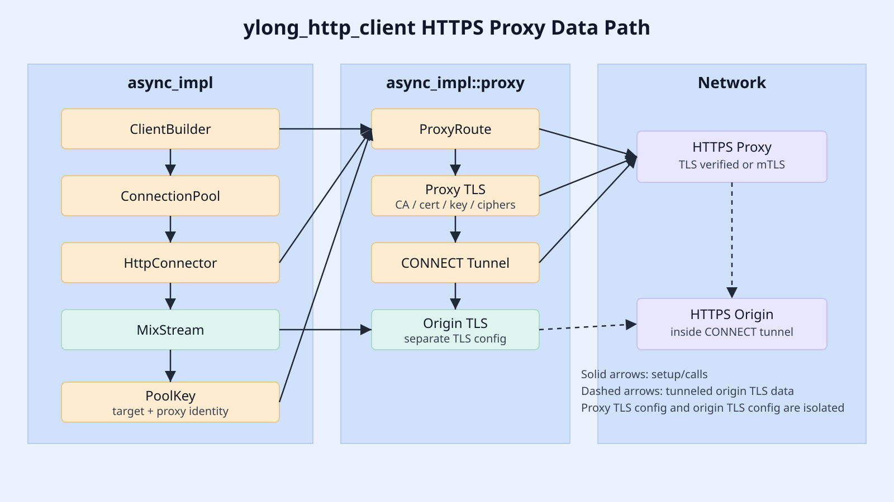

# ylong_http_client HTTPS Proxy 初赛技术方案

## 1. 项目背景

`ylong_http` 是 OpenHarmony 系统服务层使用的 Rust HTTP 协议库，向
`netstack` 等组件提供 HTTP/1.1、HTTP/2、TLS、连接池和异步客户端能力。
企业网络中常见的出站路径是 HTTPS 代理：客户端先与代理服务器建立 TLS
连接，再通过 `CONNECT` 隧道访问 HTTPS 目标站点。原有客户端只覆盖 HTTP
代理和 CONNECT 隧道，缺少“客户端到代理服务器之间启用 TLS”的完整能力。

本方案补齐 `ylong_http_client` 异步客户端的 HTTPS 代理能力，并将代理路由、
代理 TLS、CONNECT 隧道从 `HttpConnector` 中拆出，降低后续扩展 SOCKS5、
自定义代理认证和代理策略的成本。

## 2. 团队背景

参赛团队围绕 Rust 网络协议栈、TLS FFI 封装、异步运行时和性能分析开展实现。
本次提交遵循 OpenHarmony 现有代码风格，优先保证功能闭环、错误上下文、
feature 组合兼容和可复现验证。

## 3. 应用场景

- 企业内网出站访问：客户端必须经由公司 HTTPS 代理访问公网服务。
- 零信任访问控制：代理服务器要求 TLS 单向验证或 mTLS 双向验证。
- 防火墙穿越：HTTPS 目标请求通过代理 `CONNECT` 隧道转发。
- 系统服务层复用：OpenHarmony 网络服务可以复用统一 HTTP 客户端能力。

## 4. 商业价值

- 补齐企业部署必需能力，减少应用侧自建代理链路。
- 统一 HTTP/HTTPS 代理配置模型，降低上层服务接入成本。
- 通过 Rust 内存安全和 OpenSSL FFI 复用，降低系统服务层网络代码风险。
- 提供 libcurl 对比 benchmark，便于用量化指标评估后续优化收益。

## 5. 目标与非目标

| 项目 | 范围 |
| --- | --- |
| 目标 | 异步 `ylong_http_client` 支持 HTTPS proxy |
| 目标 | 支持 proxy TLS 单向验证和 mTLS |
| 目标 | 支持 proxy TLS CA、客户端证书、私钥、TLS 版本、TLS 1.3 cipher suite 配置 |
| 目标 | 将代理路由、HTTPS proxy TLS、CONNECT 隧道拆成独立模块 |
| 目标 | 提供 Rust fixture + libcurl 的可复现对比测试 |
| 非目标 | 本阶段不适配 `sync` HTTPS proxy |
| 非目标 | 本阶段不适配 HTTP/3 over proxy |
| 非目标 | 不把实验性测量代码和临时优化开关放入主线交付 |

## 6. 架构设计



图中只展示异步客户端 HTTPS proxy 主路径：

1. `ClientBuilder` 接收 `Proxy` 和 origin TLS 配置。
2. `ProxyRoute` 根据目标 URI 和 `no_proxy` 规则选择直连、HTTP proxy 或 HTTPS proxy。
3. `HttpConnector` 只负责 DNS、TCP 建连和调用代理模块，不再内联 CONNECT/TLS 细节。
4. HTTPS proxy 路径先对代理服务器做 TLS 握手和证书验证。
5. HTTPS origin 路径在代理 TLS 连接内发送 `CONNECT`，隧道成功后再对 origin 做独立 TLS 握手。
6. 连接池 key 同时包含目标地址、代理地址和代理配置身份，避免不同代理 TLS 配置复用同一连接。

## 7. 技术实现路径

### 7.1 TLS 配置扩展

`TlsConfig` 支持代理场景需要的配置项：

- CA 文件；
- 客户端证书链；
- 客户端私钥和私钥类型；
- TLS 最低/最高版本；
- TLS 1.3 cipher suite；
- TLS 1.2 及以下 cipher list；
- ALPN 列表。

代理 TLS 配置挂在 `Proxy` 上，origin TLS 配置仍然挂在 `ClientBuilder` 上。两者分别传入不同 TLS
握手，互不共享验证开关。

### 7.2 代理路由模块化

新增 `async_impl::proxy` 模块：

- `route.rs`：解析 `Proxies` 与目标 URI，输出 `ProxyRoute`。
- `http.rs`：HTTP 目标在 HTTP/HTTPS proxy 上的连接转换。
- `https.rs`：HTTPS 目标的直连、HTTP CONNECT、HTTPS proxy CONNECT。
- `tunnel.rs`：CONNECT 请求构造、响应解析和错误分类。
- `tls.rs`：异步 OpenSSL TLS 握手封装。

这种拆分把“选择代理”和“建立传输”分开。`HttpConnector` 的职责收敛为 DNS、
TCP、时间统计和连接元数据构造。

### 7.3 错误模型

- no TLS feature 下使用 HTTPS proxy 会返回明确 `Connect` 错误。
- CONNECT 返回非 2xx 时不会继续 origin TLS 握手。
- proxy TLS 和 origin TLS 错误都保留在 `HttpClientError` 的连接错误上下文中。
- proxy 认证只发送给 proxy，不进入 origin 请求。

## 8. 正确性验证

主线测试分三层：

| 层级 | 覆盖内容 |
| --- | --- |
| 单元测试 | `ProxyRoute` 选择、`no_proxy`、no TLS 显式报错、CONNECT 响应解析 |
| SDV 集成测试 | HTTPS proxy 转发、HTTPS over HTTPS、mTLS、证书/hostname/TLS 版本/cipher 失败 |
| 回归测试 | 原 HTTP proxy、no_proxy、连接池 key、无 TLS feature 编译 |

推荐命令：

```bash
cargo test -p ylong_http_client --test sdv_async_https_proxy \
  --features "async http1_1 ylong_base c_openssl_3_0" --release

cargo test -p ylong_http_client --test sdv_async_http_proxy \
  --features "async http1_1 ylong_base" --release

cargo test -p ylong_http_client --lib ut_proxy_route \
  --features "async http1_1 tokio_base" --release

cargo test -p ylong_http_client --lib ut_proxy_route \
  --features "async http1_1 tokio_base c_openssl_3_0" --release
```

## 9. 性能验证

性能验证不使用 Python fixture。正式对比使用：

- Rust HTTPS proxy fixture；
- ylong async benchmark client；
- libcurl C harness；
- HTTPS origin over HTTPS proxy；
- mixed payload；
- warmup；
- 多轮重复；
- 可选 CPU pinning；
- 可选 `perf stat`。

详细协议见 [benchmark_report.md](benchmark_report.md)。

## 10. 创新点

- 代理 TLS 与 origin TLS 配置隔离，避免安全开关误传播。
- CONNECT 隧道、HTTPS proxy TLS、代理路由独立成模块，减少 `HttpConnector` 复杂度。
- 连接池 key 引入代理配置身份，避免不同代理配置错误复用连接。
- benchmark 使用 Rust fixture 建模真实双层 TLS 路径，避免 Python 代理实现影响性能结论。

## 11. 交付清单

- 核心代码：`ylong_http_client/src/async_impl/proxy/`、TLS 配置扩展、连接池 key 扩展。
- 示例：`ylong_http_client/examples/async_https_proxy.rs`。
- 测试：`ylong_http_client/tests/sdv_async_https_proxy.rs`、route/tunnel 单元测试。
- benchmark：`tools/https_proxy_bench/`。
- 文档：本方案、benchmark 报告、知识产权与依赖说明、README 更新、架构图。

## 12. 文档规范来源

本文档结构参考 GitHub README 指南、Rust API Guidelines、Cargo manifest 文档、
ACM Artifact Review、REUSE 规范和 C4 Model。参考来源用于确定交付件索引、
可复现命令、许可证说明、artifact 证据和架构图边界。
